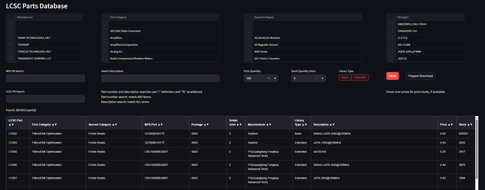

# LCSC Part Search
A database search tool for finding LCSC parts, written in python with Streamlit



## Features
- Fast, responsive interface for browsing part database (tested to ~7,000,000 parts)
- Filtering by category, part number, description, etc
- Provides cost estimates by quantity, including price breaks (where known)
- Download filtered table results as xlsx files

## Setup
First, install requirements:
```
pip install -r requirements.txt
```
Then extract demo database:
`stock.zip -> stock.parquet`

Then, run the app:
```
streamlit run main.py
```

## Demo
WIP